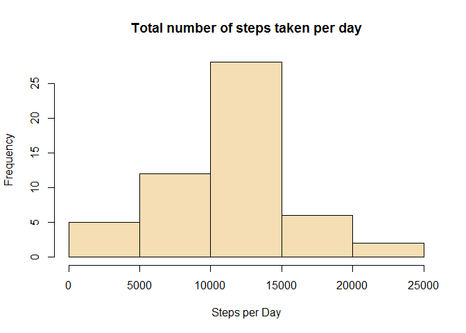
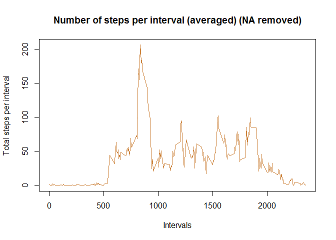
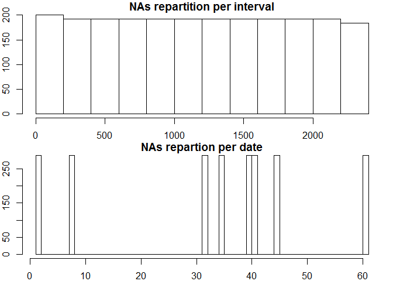

# Reproducible Research: Peer Assessment 1
Xavier Valdayron  
30 March 2017  

#INTRODUCTION

It is now possible to collect a large amount of data about personal movement using activity monitoring devices such as a Fitbit, Nike Fuelband, or Jawbone Up.  

This assignment makes use of data from a personal activity monitoring device. This device collects data at 5 minute intervals through out the day. The data consists of two months of data from an anonymous individual collected during the months of October and November, 2012 and include the number of steps taken in 5 minute intervals each day.  

#DATA
The dataset contains 3 variables and 17568 observations over a period of 61 days, October and November 2012.  

Variables:  

- steps: Number of steps taking in a 5-minute interval (missing values are coded as NA)

- date: The date on which the measurement was taken in YYYY-MM-DD format, there are 61 days in the dataset. 

- interval: Identifier for the 5-minute interval in which measurement was taken, 
There are 288 intervals per day (24 hours * 12 intervals of 5 minutes per hour), numbered from 0 to 2355.
Interval 115 will be the 5 minutes interval starting at 01.15am.
For each day, the first interval is 0 (00.00pm), the last interval is 2355 (11.55pm)

The elements below follow the structure proposed on the [assignment page](https://www.coursera.org/learn/reproducible-research/peer/gYyPt/course-project-1)


## Loading and preprocessing the data
The data was downloaded on March 27th, 2017, from [this link](https://d396qusza40orc.cloudfront.net/repdata%2Fdata%2Factivity.zip).
It can also be found in that repository: https://github.com/xvalda/RepData_PeerAssessment1  

We start by removing all objects from the workspace and load the data:

```r
#remove all objects
rm(list=ls())
#set working directory: we skip this step and let the reader set their own working directory. 

#we check if the source file is loaded onto the wd of the reader, if not, we download it and unzip the file:
if(!file.exists("activity.csv")) {
        tempfile <- tempfile()
        download.file("http://d396qusza40orc.cloudfront.net/repdata%2Fdata%2Factivity.zip",destfile = tempfile)
        unzip(tempfile)
        unlink(tempfile)
}
#load data
activity <- read.csv("activity.csv")
```

We can then inspect the dataset: 

```r
summary(activity)
```

```
##      steps                date          interval     
##  Min.   :  0.00   2012-10-01:  288   Min.   :   0.0  
##  1st Qu.:  0.00   2012-10-02:  288   1st Qu.: 588.8  
##  Median :  0.00   2012-10-03:  288   Median :1177.5  
##  Mean   : 37.38   2012-10-04:  288   Mean   :1177.5  
##  3rd Qu.: 12.00   2012-10-05:  288   3rd Qu.:1766.2  
##  Max.   :806.00   2012-10-06:  288   Max.   :2355.0  
##  NA's   :2304     (Other)   :15840
```

```r
str(activity)
```

```
## 'data.frame':	17568 obs. of  3 variables:
##  $ steps   : int  NA NA NA NA NA NA NA NA NA NA ...
##  $ date    : Factor w/ 61 levels "2012-10-01","2012-10-02",..: 1 1 1 1 1 1 1 1 1 1 ...
##  $ interval: int  0 5 10 15 20 25 30 35 40 45 ...
```

## What is mean total number of steps taken per day?
###1. Total number of steps taken per day
We use the aggregate function, removing NAs, and draw the histogram with base plotting: 

```r
activity_steps_day <- aggregate(steps ~ date, data = activity, FUN = sum, na.rm = TRUE)
```

###2. Histogram of the total number of steps taken each day.

```r
hist(activity_steps_day$steps, xlab = "Steps per Day", main = "Total number of steps taken per day", col = "wheat")
```

<!-- -->
  
Note: we could set the number of breaks (bins) to values higher than 5, but we chose not to, the insights seem sufficient at this stage. 

###3. Mean and median of the total number of steps taken per day

```r
mean_steps <- mean(activity_steps_day$steps)
median_steps <- median(activity_steps_day$steps)
#we set a normal number format to display the results
mean_steps <- format(mean_steps,digits=1)
median_steps <- format(median_steps,digits=1)
```
Mean steps per day: **10766**  
Median steps per day: **10765**   

## What is the average daily activity pattern?
###1. Time series plot 
Time series plot of the 5-minute interval (x-axis) and the average number of steps taken, averaged across all days (y-axis)

```r
#Aggregate function for mean over all days, for each interval
activity_steps_mean <- aggregate(steps ~ interval, data = activity, FUN = mean, na.rm = TRUE)
#Plot
plot(activity_steps_mean$interval, activity_steps_mean$steps, type = "l", col = "tan3", xlab = "Intervals", ylab = "Total steps per interval", main = "Number of steps per interval (averaged) (NA removed)")
```

<!-- -->

###2. Which 5-minute interval, on average across all the days in the dataset, contains the maximum number of steps?

```r
#what is the highest steps value? (maximum of steps on one given interval)
max_steps <-max(activity_steps_mean$steps)
#for which interval are the numbers of steps per interval at the highest?
max_interval <- activity_steps_mean$interval[which(activity_steps_mean$steps == max_steps)]
max_steps <- round(max_steps, digits = 2)
```
The highest number of steps for a 5 minutes interval is **206.17**,  
which corresponds to interval **835**  

## Imputing missing values
###1. Calculate total number of missing values in the dataset

```r
sum(is.na(activity))
```

```
## [1] 2304
```
This corresponds to the summary results found at the top of document, all NA values found in 'steps' variable only.

###2. Devise a strategy for filling in all of the missing values in the dataset
We run a couple of unsophisticated charts to decide which unsophisticated strategy we'll adopt  

```r
#subset general dataset with missing values only
missing_values <- subset(activity, is.na(steps))
#plot repartition, by date or by intervals
par(mfrow = c(2,1), mar = c(2, 2, 1, 1))
hist(missing_values$interval, main="NAs repartition per interval")
hist(as.numeric(missing_values$date), main = "NAs repartion per date", breaks = 61)
```

<!-- -->

We see that NAs run equally over all intervals. On the other hand, checking with dates, we see all NA's are spread between 8 specific days only. To reduce that effect, best will be to take the mean for missing interval across all the days in the dataset. 

###3. Create new dataset with the missing data filled in
We'll follow these steps to replace the missing data:  
- calculate average steps per interval, across all the days  
- cut the 'activity' dataset in two parts: activity_NAs, activity_non_NAs  
- in 'activity_NAs', we convert, we convert the 'steps' variable into a factor, then replace levels with new computed values  
- a bit of formatting to convert the 'steps' vector variable into an integer vector  
- merge/rbind the two datasets into a new dataset, with missing data filled in  


```r
# calculate mean of steps per interval, we end up with a mean for all 288 intervals
MeanStepsPerInterval <- tapply(activity$steps, activity$interval, mean, na.rm = TRUE)
# cut the 'activity' dataset in 2 parts (with and without NAs)
activity_NAs <- activity[is.na(activity$steps),]
activity_non_NAs <- activity[!is.na(activity$steps),]
#replace missing values in activity_NAs
activity_NAs$steps <- as.factor(activity_NAs$interval)
levels(activity_NAs$steps) <- MeanStepsPerInterval
#change the vector back as integer 
levels(activity_NAs$steps) <- round(as.numeric(levels(activity_NAs$steps)))
activity_NAs$steps <- as.integer(as.vector(activity_NAs$steps))
#merge/rbind the two datasets together
imputed_activity <- rbind(activity_NAs, activity_non_NAs)
```

###4. Make a histogram of the total number of steps taken each day 


```r
#Plotting parameters to place previous histogram and new one next to each other
par(mfrow = c(1,2))
#Plot again the histogram from the first part of the assignment
activity_steps_day <- aggregate(steps ~ date, data = activity, FUN = sum, na.rm = TRUE)
hist(activity_steps_day$steps, xlab = "Steps per Day", main = "NAs REMOVED - Total steps/day", col = "wheat")
#Plot new histogram, with imputed missing values
imp_activity_steps_day <- aggregate(steps ~ date, data = imputed_activity, FUN = sum, na.rm = TRUE)
hist(imp_activity_steps_day$steps, xlab = "Steps per Day", main = "NAs IMPUTED - Total steps/day", col = "wheat")
```

<!-- -->
  
We calculate like previously the mean and median values, and store the new and old results in a data frame for easier comparison: 


```r
imp_mean_steps <- mean(imp_activity_steps_day$steps)
imp_median_steps <- median(imp_activity_steps_day$steps)
#we set a normal number format to display the results
imp_mean_steps <- format(imp_mean_steps,digits=1)
imp_median_steps <- format(imp_median_steps,digits=1)
#store the results in a dataframe
results_mean_median <- data.frame(c(mean_steps, median_steps), c(imp_mean_steps, imp_median_steps))
colnames(results_mean_median) <- c("NA removed", "Imputed NA values")
rownames(results_mean_median) <- c("mean", "median")
```

We use the xtable package to print the table with all values: 

```r
library(xtable)
```

```
## Warning: package 'xtable' was built under R version 3.3.3
```

```r
xt <- xtable(results_mean_median)
print(xt, type  = "html")
```

<!-- html table generated in R 3.3.2 by xtable 1.8-2 package -->
<!-- Thu Mar 30 18:26:28 2017 -->
<table border=1>
<tr> <th>  </th> <th> NA removed </th> <th> Imputed NA values </th>  </tr>
  <tr> <td align="right"> mean </td> <td> 10766 </td> <td> 10766 </td> </tr>
  <tr> <td align="right"> median </td> <td> 10765 </td> <td> 10762 </td> </tr>
   </table>

CONCLUSIONS:  
Imputing missing values didn't change the mean value whatsoever, the median value is reduced only by 0.027% (3/10765*100), which is as good as nothing.  
Both histograms show the same structure, with imputed NAs we notice however higher frequencies.  

## Are there differences in activity patterns between weekdays and weekends?
###1. Create a new factor variable

```r
#elseif function to categorize Saturday and Sunday as factor level "weekend", all the rest as "weekday"
imputed_activity$dayType <- ifelse(weekdays(as.Date(imputed_activity$date)) == "Samstag" | weekdays(as.Date(imputed_activity$date)) == "Sonntag", "weekend", "weekday")
#transform dayType variable into factor
imputed_activity$dayType <- factor(imputed_activity$dayType)
```

###2. Panel plot containing time series plot


```r
#Aggregate a table showing mean steps for all intervals, acrlss week days and weekend days
steps_interval_dayType <- aggregate(steps ~ interval + dayType, data = imputed_activity, FUN = mean)
#verify new dataframe 
head(steps_interval_dayType)
```

```
##   interval dayType      steps
## 1        0 weekday 2.28888889
## 2        5 weekday 0.40000000
## 3       10 weekday 0.15555556
## 4       15 weekday 0.17777778
## 5       20 weekday 0.08888889
## 6       25 weekday 1.57777778
```

```r
#add descriptive variables
names(steps_interval_dayType) <- c("interval", "day_type", "mean_steps")
#plot with ggplot2
library(ggplot2)
plot <- ggplot(steps_interval_dayType, aes(interval, mean_steps))
plot + geom_line(color = "tan3") + facet_grid(day_type~.) + labs(x = "Intervals", y = "Average Steps", title = "Activity Patterns")
```

<!-- -->
  
CONCLUSION: it seems the tested subjects have an earlier start in the week days with a peak between 8am and 9am. On weekends, the activity seems more spread between 8am and 8pm. 
